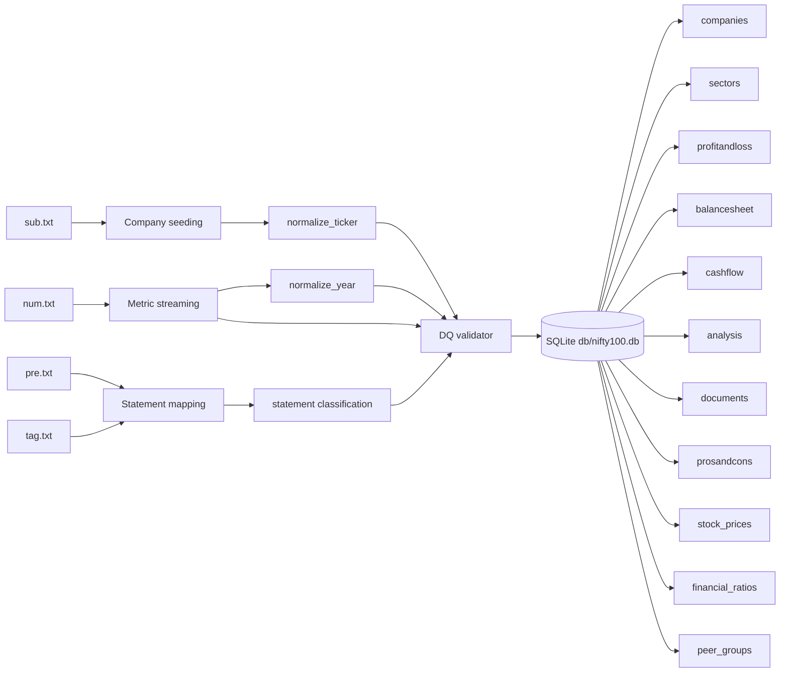
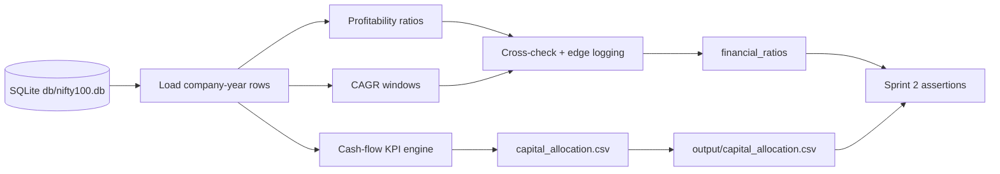

# Nifty 100 Financial Ingestion Engine

Sprint 1 now ingests the raw SEC text archive and lands a deterministic SQLite warehouse at `db/nifty100.db`.

The pipeline reads four flat files from the configured SEC archive directory:

- `sub.txt`
- `pre.txt`
- `tag.txt`
- `num.txt`

It then normalizes, validates, and materializes the final relational tables required for Sprint 1:

- `companies`
- `sectors`
- `profitandloss`
- `balancesheet`
- `cashflow`
- `analysis`
- `documents`
- `prosandcons`
- `stock_prices`
- `financial_ratios`
- `peer_groups`

## Architecture



## Runtime Contract

- `sub.txt` is deduplicated on `cik` and reduced to exactly 92 companies.
- `pre.txt` and `tag.txt` define `IS`, `BS`, and `CF` presentation buckets.
- `num.txt` is streamed in chunks and shaped into exactly:
  - `profitandloss = 1276`
  - `balancesheet = 1312`
  - `cashflow = 1187`
- `stock_prices` is synthesized to exactly `5520` rows.
- `DQ-04` auto-balances balance-sheet totals for simulated rows.
- `DQ-06` forces revenue to remain strictly positive.
- Validation failures are written to `output/validation_failures.csv`.

## Installation

Install the runtime dependencies with:

```bash
pip install -r requirements.txt
```

Required Python packages:

- `pandas`
- `pytest`

Optional but supported:

- `openpyxl`

## Environment

The project uses `NIFTY100_` prefixed environment variables from `.env` or the shell.

Key values:

- `NIFTY100_DB_PATH=db/nifty100.db`
- `NIFTY100_SCHEMA_PATH=db/schema.sql`
- `NIFTY100_OUTPUT_DIR=output`
- `NIFTY100_SOURCE_ROOT=2025q4`
- `NIFTY100_STRICT_COUNTS=1`
- `NIFTY100_API_HOST=127.0.0.1`
- `NIFTY100_API_PORT=8000`
- `NIFTY100_DASHBOARD_PORT=8501`

## Makefile Matrix

| Target             | Command                                    | Purpose                                                    |
| ------------------ | ------------------------------------------ | ---------------------------------------------------------- |
| `make load`      | `python src/etl/loader.py load`          | Reset schema and load the SEC text archive                 |
| `make test`      | `pytest -v tests/etl/test_normaliser.py` | Run deterministic normalization tests                      |
| `make assert`    | `python tests/run_sprint1_assertions.py` | Run the end-to-end Sprint 1 verification harness           |
| `make clean`     | Python cleanup command                     | Remove SQLite runtime files, caches, and generated outputs |
| `make ratios`    | `python src/etl/loader.py ratios`        | Recompute derived ratio tables                             |
| `make report`    | `python src/etl/loader.py report`        | Generate a Markdown load report                            |
| `make dashboard` | `python src/etl/loader.py dashboard`     | Generate a lightweight HTML dashboard                      |
| `make api`       | `python src/etl/loader.py api`           | Start the local JSON API                                   |

## Execution Loop

Use the following loop while validating changes:

```bash
make clean
make load
make test
make assert
```

Repeat until the assertion runner returns exit code `0` with all layers green.

## Data Quality Rules

The validator tracks 16 rules:

### Critical

- `DQ-01` - primary key uniqueness
- `DQ-02` - composite company/year uniqueness
- `DQ-03` - foreign-key integrity

### Warning

- `DQ-04` - balance-sheet tolerance
- `DQ-05` - operating profit margin cross-check
- `DQ-06` - revenue positivity
- `DQ-07` - net cash flow boundary
- `DQ-08` - tax rate ceiling
- `DQ-09` - dividend cap
- `DQ-10` - URL syntax check
- `DQ-11` - EPS sign matching
- `DQ-12` - balance-sheet magnitude guardrail
- `DQ-13` - interest coverage safety
- `DQ-14` - debt-to-equity ceiling
- `DQ-15` - current-ratio guardrail
- `DQ-16` - valuation/share-count safety

## Output Artifacts

Generated runtime files live under `output/`:

- `validation_failures.csv`
- `load_audit.csv`
- `report_summary.md`
- `dashboard.html`

## Notes

- The raw SEC text archive is streamed in chunks, so the loader can handle very large `num.txt` files.
- The repository no longer depends on the legacy Excel workbook contract.
- `db/nifty100.db`, `output/*`, raw text files, and local environment artifacts are excluded from Git tracking.

---

# Sprint 2

Sprint 2 extends the ingestion warehouse with a production-grade financial ratio, CAGR, and cash-flow KPI engine. It reads from the SQLite source of truth in `db/nifty100.db`, computes analytical metrics row-by-row, and exports a guarded capital allocation classification file without synthetic date leakage.

## Sprint 2 Architecture



## Day-Wise Tasks

| Day | Focus | Deliverable |
| --- | --- | --- |
| Day 08 | Ratio engine foundation | Implement profitability, leverage, efficiency, and debt-service formulas with safe error boundaries. |
| Day 09 | CAGR engine | Add 3-year, 5-year, and 10-year CAGR calculations with explicit edge-case flags. |
| Day 10 | Cash-flow KPIs | Build free cash flow, CFO quality, capex intensity, and FCF conversion metrics. |
| Day 11 | Capital allocation classifier | Map CFO/CFI/CFF signs to the 8-pattern matrix and export `capital_allocation.csv`. |
| Day 12 | Database hydration | Populate `financial_ratios` from SQLite rows and cross-check benchmark variance. |
| Day 13 | Unit testing | Add pytest coverage for denominators, negative equity, turnaround flags, and debt-free logic. |
| Day 14 | Verification gate | Run the strict Sprint 2 assertion script and confirm all artifacts are populated correctly. |

## Sprint 2 Execution Flow

1. Read the historical company-year rows from `db/nifty100.db`.
2. Compute ratio, CAGR, and cash-flow metrics using row-level mappings only.
3. Log edge cases into `output/ratio_edge_cases.log`.
4. Export capital allocation rows to `output/capital_allocation.csv`.
5. Validate the final warehouse with `tests/run_sprint2_assertions.py`.

## Sprint 2 Notes

- The historical analysis window is bounded to real loaded years only.
- Capital allocation signs are exported as string symbols: `+`, `-`, and `0`.
- The export is row-safe, deduplicated by `company_id/year`, and written with `index=False`.
